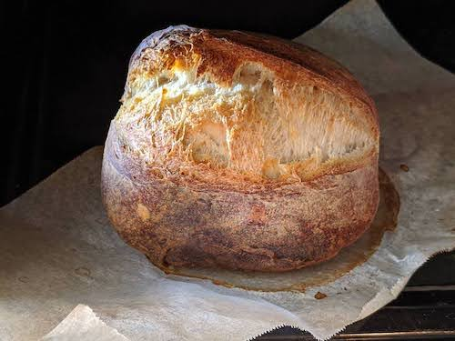
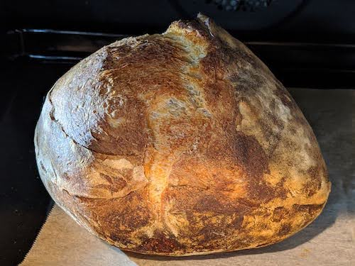
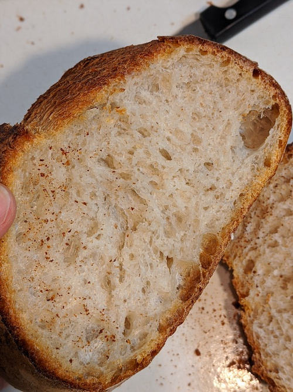
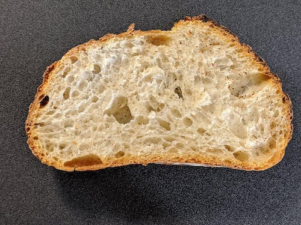
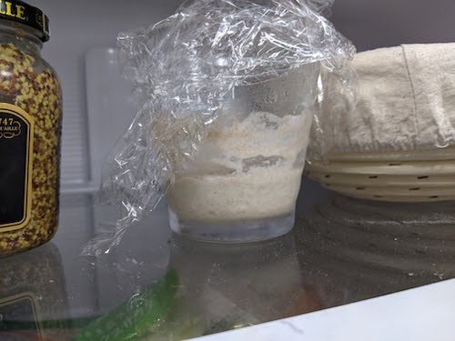
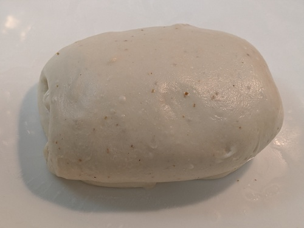
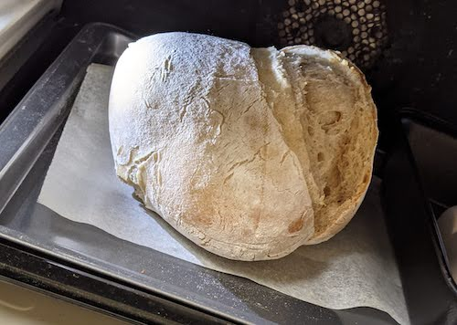

# Baking Okay Bread Without Measurements

A sourdough bread recipe using sight, touch, smell, an no measurements. The advantage of mastering a recipe by feel is that you can adapt it no matter the amount you make, differences in temperature, or other unexpected circumstances. The feeling you are going for is in bold in the text.

 

*Two different loaves baked with this recipe. Note the good oven spring and ear on the first one*

 

*Open crumbs, with specks of whole flour.*

I failed about 60 loaves over a year to find the right "feel" and tried everything you're not supposed to do (salt with the yeast! elderly starter! crappy oven!) to see if you're really not supposed to do it, and now my loaves are consistently ok-looking, so I'm pretty confident I got the basics down.
Main influence: Joy Ride Coffee on Youtube.

## Ingredients

**Sourdough starter**. The easy kind. See step 0.

**White wheat flour**. I use either regular flour or bread flour.

**Whole wheat flour** (optional). I like the color it gives to my bread. You can use whatever proportions of white/whole, although if you use more whole flour than white flour your bread will rise less.

**Water, salt.**

You'll also need a large bowl to let the bread rise, a large flat plate (with rising edges, especially if your dough is wet), an oven that goes at least to 250C (480F) but 300C (570F) is best, baking paper and some coarse corn flour to prevent the dough from sticking if you are making a very wet dough. Wet or dry dough, having a banetton will definitely help your it not sticking during the proofing stage.

## Instructions

### 0. Starter 

You'll find a ton of advice online about how to make a starter, keeping it alive, and when to use it. I go the easy route. I use starter past its prime rise, as long at is **smells good (sweet, slightly sour, yoghurt-like or alcohol-like smell**, not funky) and is not moldy. I keep it in the fridge for several weeks and don't feed it. I just take it out a few hours before use. You can refesh yours a day before if you're nervous, but the age and amount of starter only seem to affect how long your bread will take to rise. I don't mind waiting a bit, so I use very little starter. No matter the final size of the loaf this is about the amount I use (Sometimes double or triple that, sometimes less if parts of the starter have dried out. Leave those out). I use all of it, then cut a very small bit of my bread dough (before the shaping step), mix that mix some flour and water, and put it in the fridge: that's my starter for the next time. No waste!

 

### I. Autolysis

1. Decide if you are making a wet or drier dough (it's not really dry, just very firm). Wet doughs are harder to work with because they stick to everything and don't keep their shape, but they ferment much faster which is great if you are in a hurry. Dry doughs are harder to knead, but much much easier to work with afterwards. They shape well and don't stick.
2. In a large bowl, put some of your flour. If you are making a wet dough, about 2/3 should be fine. If you are making a dry dough, maybe 1/2 is better. In any case, if you have a lot of flour at home, it's better to put too much in the bowl now than not enough. If you are using whole flour, put all of it and top up with some of your white flour.
3. Add a bit of water and stir. Continue adding water little by little and stirring until you get something **the consistency of oatmeal:** wet, but more sticky than liquid. You don't need to knead yet. Adding water to flour causes gluten bonds to develop over time, and it goes faster if you have lots of water in there. This step is called autolyse.
4. Cover so it does not dry out and let your dough rest until you can stretch a bit of it between your fingers and **see through it without it breaking.** This is called the "window pane test". Passing the test is a sign that your the gluten has formed a film, which gives the dough structure and strength. I put my dough in the oven at 30C to 45C for at least 20 min and more as needed, but you can just let your dough rest at room temperature. What matters is that is passes the test.

### II. Rise

5. Add the starter, some salt (not enough is better than too much, you'll learn with time how much you like in your own bread). Add the rest of your flour to the dough little by little and stir or knead until everything **looks well incorporated** (Adding flour is easy, but adding water at this stage makes things messy. You won't ruin your bread, but you will have a hard time kneading.). **A very wet dough can be almost liquid, like a cheese fondue. A dry dough can be firmer than playdoh, even the consitency of potter's clay.** Anything in between is fair game. Stop kneading when the dough has taken in all the flour, don't overdo it.
6. Cover the dough and let it rest until **is passes the window pane test** again. If you have not added a lot of flour, it should not take very long, from a couple of minutes to a dozen. If you have overkneaded the dough, this can take a bit longer. After the dough passes the window test, **it should not stick to wet hands**, even if you started with a super sticky, super wet dough.
7. Rinse your flat plate, shake some of the water off but don't dry it completely. Wet your hands, take the dough out and put it on the plate. Fold the dough in 3 like folding a paper later (stretch the dough first  if necessary), press on it to flatten it, rotate it 90 degrees and and fold it in 3 again. Wet your hands regularly to avoid sticking. Repeat until **the surface of the dough just starts to break**, and if possible stop just before that. The goal is simply to get your dough layers quite thin. This step is called lamination. As long as you get your dough to be made of one large thin layer folded unto itself, it does not really matter whether you fold it, or roll it, or stretch it into a big pizza and then fold it up...
8. Put the dough on the plate. Cover the dough (don't let it stick to the cover) and wait until it **slacks off** and loses its shape. A wet dough might become completely flat, while a dry dough will only flatten a bit. It will probably take from 10 to 20 minutes. Fold the dough in 3 and put it back to rise. Repeat until you **see small bubbles  under the surface of the dough** (big ones might be due to the folding process, so just pop them and wait for the small bubbles). When you see bubbles, don't fold and go to the next step. I use very little starter, so my dough takes a lot of time to rise even in my 45C oven; I fold it every 20 to 25 min, 3 to 4 times.
9. Sprinkle flour on a flat surface and transfer the dough to it by overturning the plate over it. Flour your fingers, and fold the dough in 3. Pinch all of the edges of the dough, making a suture to seal it shut. The dough will be slightly rectangular.

 

*dough with small bubbles under the surface*

### III. Proofing and baking

10. Prepare the bowl (or banetton) in which you will proof your dough. If your dough is wet, cover its surface with coarse corn flour. If it's very dry, you might not even need to use normal flour to prevent the dough from sticking to the bowl. Put the dough in the bowl, the biggest suture facing up. Cover your bowl.
11. Wait until the dough is ready to bake: this step is called proofing. You will know by **pushing your finger in the dough to make a deep dent** in it. If the dent bounces back immediately, your dough is not ready. If the dent just stays there, you have waited too much and the dough has overproofed. If the dent comes back up slowly, your dough is ready. It should feel **soft like a relaxed muscle**, not firm and and not mushy. You can proof your dough at room temperature, or put it the fridge overnight or even a full day and then take it out to room temperature to finish proofing. In the fridge, lactic bacteria develop faster than yeast, so your dough will get that sour "sourdough" flavour without rising, so you have no risk of overproofing and you can bake your bread in the morning. If you skip the fridge step, especially if you have done all the rising in a warm oven as I do, your bread will be a bit bland.
12. Finally! The baking! Ideally you would preheat your oven at 300C, add a bit of hot water in a bowl, cut a long curved line on the top of your bread from edge to edge to open the skin (scoring) and start baking. If, like me, your oven is weak (250C), don't score your bread immediately. Put it on a baking sheet in the preheated oven with the water, and wait until the bottom of the bread **starts lifting from the baking paper**. Open the oven and score the bread, then put it back to bake. I heard that if you bake in a pot, you will get much more beautiful bread, and I'm sure it's true.
13. When the bread has stopped opening and puffing, which should take around 15 min, lower the temperature to 250C and take the water out of the oven. Bake until brown, turning the bread around if one side is baking faster than the other. You basically can't over-bake bread, so wait until it's **well browned**. Turn the oven off, open the door just a little and let your bread cool down.

 

*The dough has stopped puffing, it is time to remove the water and let it brown*
